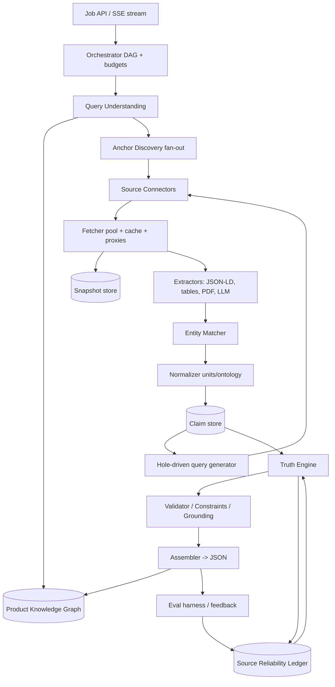

# 02. Архітектура

## 1. Принципи

1. **Claims, not documents.** Внутрішня одиниця даних не "сторінка", а *claim*: `(entity_match, field, value, unit, evidence_span, source, extractor_confidence)`. Уся система працює з потоками claims.
2. **Anchor before harvest.** Спочатку встановлюємо ідентичність (identifiers), потім збираємо атрибути. Без якоря claims не приймаються у вихід.
3. **Source as plugin.** Кожне джерело реалізує єдиний інтерфейс `SourceConnector`. Додати новий маркетплейс або регіональний агрегатор = один модуль.
4. **Budgets everywhere.** Кожен прогін має бюджет часу, грошей, HTTP-запитів, LLM-токенів. Оркестратор ріже гілки DAG, які не вкладаються.
5. **Everything is evidence-linked.** Raw snapshot кожної сторінки зберігається (content-addressed). Будь-яке значення у виході можна відмотати до байтів, з яких воно виведене.
6. **Learn from every run.** Знайдені aliases, identifiers, надійність джерел і категорійні шаблони потрапляють у Product Knowledge Graph і Reliability Ledger.

## 2. Компоненти



### 2.1 Job API

- `POST /v1/products/resolve` → `run_id`, режим, підказки, бюджет.
- `GET /v1/runs/{run_id}/stream` → SSE з подіями `anchor_found`, `field_update`, `round_done`, `final`.
- `GET /v1/runs/{run_id}/trace` → повний trace для аудиту.
- Batch endpoint для каталогів: `POST /v1/products/resolve:batch` (N назв, пріоритети, спільний бюджет).

### 2.2 Query Understanding (QU)

Виходи: структурована гіпотеза запиту.

- Токенізація з урахуванням кодів моделей (`6ES7214-1AG40-0XB0` не має ламатися на дефісах), транслітерації (кирилиця/латиниця), OCR-подібних помилок (`0`/`O`, `1`/`l`).
- Brand detection (словник + PKG + LLM fallback), model/variant extraction, витяг identifiers regex-ами (GTIN-8/12/13/14 з перевіркою контрольної суми, ASIN `B0[A-Z0-9]{8}`, MPN-патерни по брендах).
- Category guess (класифікатор поверх PKG-таксономії, fallback LLM) → визначає, яка категорійна схема і які конектори пріоритетні.
- Генерація **query variants**: оригінал, нормалізований, без варіанта, тільки модель, `brand + model + "datasheet"`, `brand + model + "specifications"`, `model + "pdf"`, переклади (en, de, zh, ja, pl, ru, uk) залежно від бренду і категорії, лапковані точні коди.

### 2.3 Orchestrator

- DAG-виконання з fan-out/fan-in, реалізація на Temporal (durable, retries, child workflows) або на asyncio + Redis-черзі для MVP.
- Кожна нода має `cost_estimate`, `expected_gain` (з ledger: скільки нових полів це джерело зазвичай дає для цієї категорії), `deadline`. Планувальник greedy максимізує `gain/cost` у межах бюджету.
- **Early stop:** коли marginal gain раунду < ε або всі поля схеми `verified`.
- **Спекуляція:** для T1 одразу запускаються connector-и рівня A/B паралельно з пошуком, не чекаючи якоря, але їх claims тримаються у карантині до підтвердження entity match.
- Circuit breaker + rate limiter на кожен конектор, per-domain concurrency.

### 2.4 Source Connectors

Інтерфейс:

```python
class SourceConnector(Protocol):
    id: str
    tier: Literal["A", "B", "C", "D", "E"]
    capabilities: set[Literal["search", "lookup_by_id", "fetch", "category_specs"]]
    async def search(self, q: QueryVariant, ctx: RunContext) -> list[Lead]: ...
    async def lookup(self, ids: Identifiers, ctx: RunContext) -> list[Lead]: ...
    def cost(self, op: str) -> Cost: ...
```

`Lead` = URL + метадані + попередній entity-match score. Групи конекторів описані в док 04.

### 2.5 Fetcher

- Двошаровий: `httpx` (HTTP/2, keep-alive) → Playwright тільки якщо контент рендериться JS або є challenge.
- Кеш snapshot-ів по `sha256(url_normalized)` з TTL за класом контенту (datasheet 90 днів, сторінка магазину 1 день, ціна 1 год).
- Проксі-пул за регіонами (деякі маркетплейси віддають різні дані за регіоном).
- Політика: robots.txt, rate limits, ToS-ліст доменів з режимами `allow / api_only / deny`.
- Виходи: raw bytes, MIME, final URL, HTTP-мета, витягнутий main-content (trafilatura/readability), таблиці, JSON-LD блоки, посилання на PDF/зображення.

### 2.6 Extractors (шарами, від дешевого до дорогого)

1. **Structured:** JSON-LD `schema.org/Product`, `Offer`, microdata, OpenGraph, `<meta>`; Amazon/eBay/Rozetka-специфічні парсери.
2. **Table/spec-block parser:** евристики для `<table>`, `<dl>`, "Key: Value" блоків, з нормалізацією назв атрибутів через ontology-mapper (synonym dictionary + embeddings).
3. **PDF:** `pdfplumber`/`pymupdf` + layout-aware table extraction; для сканів OCR (Tesseract/PaddleOCR) з позначкою `ocr=true` (нижча extractor confidence).
4. **LLM extractor:** structured output за категорійною схемою, обов'язковий `evidence_span` (символьні офсети), температура 0, self-consistency ×2 для полів з високою ставкою. LLM бачить тільки main-content, не всю сторінку.
5. **Vision (deep-mode):** витяг з зображень спеків/шильдиків, штрихкодів (zbar).

Кожен claim отримує `extractor_confidence` з калібрування (док 08).

### 2.7 Entity Matcher

Оцінює, чи сторінка про **той самий товар і варіант**:

- identifier match (GTIN/MPN/ASIN) → 1.0;
- exact normalized model string + brand → 0.9;
- fuzzy model (token-set ratio, edit distance з урахуванням код-патернів) + узгодженість уже відомих атрибутів → 0.5-0.85;
- детекція "сусідів": відмінність в одному символі коду моделі (`GSR 12V-35` vs `GSR 12V-35 FC`) → жорсткий штраф;
- variant axes (color, storage, region, voltage, pack size) звіряються окремо; невідповідність по варіантній осі → claims про variant-specific поля відкидаються, спільні (вага, чіпсет) залишаються з позначкою `shared_across_variants`.

### 2.8 Normalizer

- Одиниці: `pint` + власні правила (дюйми/мм, фунти/кг, Вт·год, мАг+В → Вт·год).
- Локальні числа (`1.234,56` vs `1,234.56`), діапазони (`10-15 kg`), tolerance (`±5%`).
- Enum-мапінг (`чорний`/`black`/`schwarz`/`黑色` → `black`), кольори до канонічного словника + оригінал.
- Канонічні ключі атрибутів через ontology (категорійні набори + синоніми).

### 2.9 Truth Engine

Ітеративне зважене голосування з незалежністю джерел і constraints. Детально в док 03.

### 2.10 Validator / Guard

- JSON Schema валідація.
- Hard constraints: контрольні суми, діапазони по категорії, крос-польові формули, типи.
- Grounding check: значення (після нормалізації) має знаходитись у `evidence_span` джерела, інакше claim відхиляється (захист від галюцинацій LLM-екстрактора).
- Variant leakage check.

### 2.11 Product Knowledge Graph (PKG)

Postgres (+ `pgvector` для embeddings назв/aliases):

- `product(id, canonical_name, brand, category, lifecycle)`;
- `identifier(product_id, type, value, source, confidence)`;
- `alias(product_id, text, lang, source)`;
- `variant(product_id, axes jsonb)`; `product_relation(parent, child, type: variant|successor|predecessor|family)`;
- `claim(...)`, `resolved_field(product_id, field, value, status, confidence, resolved_at, evidence[])`;
- `snapshot(hash, url, fetched_at, mime, storage_key)`.

Зі зростанням PKG частина запитів взагалі не ходить у веб: кеш-хіт по alias → повертаємо resolved fields + фоновий refresh.

### 2.12 Source Reliability Ledger

Таблиця `(source_domain, category, field) → (alpha, beta)` Beta-розподілу: скільки разів джерело погоджувалось з фінальною істиною, скільки суперечило. Використовується як prior ваги у Truth Engine. Оновлюється після кожного прогону і з ручного фідбеку.

### 2.13 Observability

OpenTelemetry traces на кожну ноду DAG, метрики: latency per connector, hit-rate кешу, claims per source, conflict rate per field, cost per run. Дашборд "які поля найчастіше `unknown` за категоріями" → пріоритет нових конекторів.

## 3. Модель паралелізму

- **Рівень 1:** N товарів одночасно (batch) — окремі workflow.
- **Рівень 2:** усередині товару — fan-out по query variants × connectors (десятки задач), fan-in у claim store.
- **Рівень 3:** усередині джерела — паралельний fetch top-K leads з per-domain лімітом.
- **Рівень 4:** екстрактори на одну сторінку запускаються паралельно (structured + table + LLM), результати зливаються.

Раунди залежні (hole-driven search потребує результатів попереднього), але всередині раунду все паралельне. Early-stop працює на рівні раунду і на рівні поля (поле, що вже `verified`, виключається з наступних hole-запитів).

## 4. Стек (рекомендація)

| Шар | Вибір | Чому |
|-----|-------|------|
| Мова | Python 3.12, asyncio | Екосистема парсингу/ML, pdf, OCR, pint |
| Оркестрація | Temporal (prod), asyncio+Redis (MVP) | Durable, retries, видимість DAG |
| HTTP | httpx + Playwright | HTTP/2, headless тільки при потребі |
| Парсинг | selectolax, trafilatura, pdfplumber/pymupdf, PaddleOCR | швидко, layout-aware |
| Схеми | Pydantic v2 + JSON Schema | валідація, structured output для LLM |
| LLM | Claude (extraction/judge), локальна модель для дешевої класифікації | точність structured output, tool use |
| Сховище | Postgres + pgvector, S3-сумісний object store, Redis | PKG, snapshots, кеш/черги |
| Пошук | SerpAPI/Serper (Google), Bing API, Brave, Yandex XML, Baidu, Exa, Tavily | різноманітність індексів |
| Eval | pytest + власний harness, golden dataset у репо | CI-гейт |

## 5. Безпека та відповідність

- Немає персональних даних у виході; відгуки використовуються лише як сигнал, не копіюються.
- ToS-політика доменів версіонується в конфігу; дефолт для невідомого домену — `allow` з robots.txt + м'які rate limits.
- Секрети конекторів у vault, ключі ротуються; per-connector cost caps.
